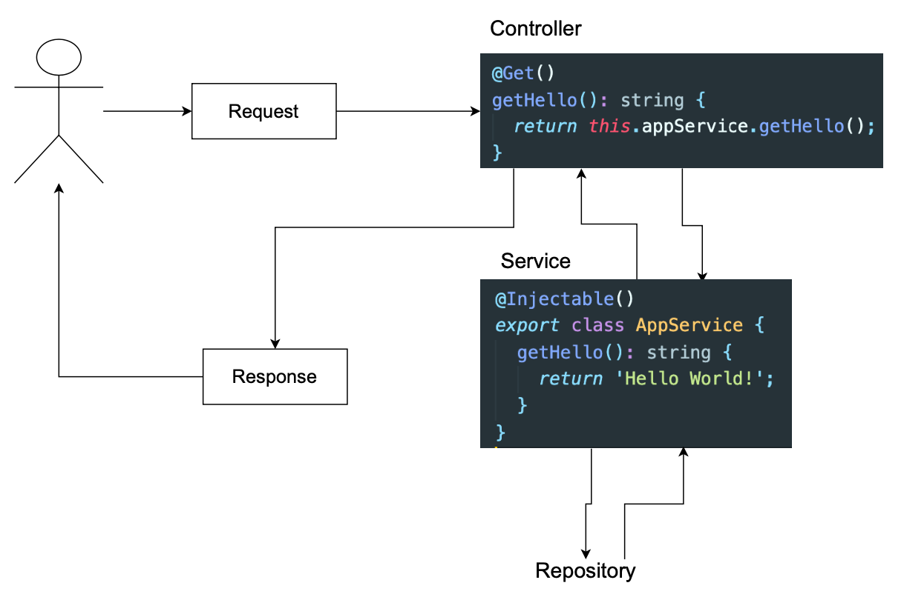

# CloneApp

출처 : [따라하는 네스트 제이에스](https://www.inflearn.com/course/%EB%94%B0%EB%9D%BC%ED%95%98%EB%8A%94-%EB%84%A4%EC%8A%A4%ED%8A%B8-%EC%A0%9C%EC%9D%B4%EC%97%90%EC%8A%A4)

## 기본요소

- service를 controller에서 이용하기

  ```typescript
  boardsService: BoardsService;
  constructor(boardsService: BoardsService) {
      this.boardsService = boardsService;
  }
  constructor(private boardsService: BoardsService) {} // 접근 제한자를 붙이면 위의 코드를 간단하게 한줄로 표현가능
  ```

## CRUD

### 배열 정의 및 배열 Read

- service에서 배열 정의 및 리턴값 불러오기

  ```typescript
  private boards = [];
  getAllBooks() {
      return this.boards;
  }
  ```

- controller 객체에서 라우터 설정(@GET, @POST, @PUT, @PATCH..)하여 새로운 메소드 내에서 service 객체 이용

  ```typescript
  @Get('/')
  getAllBoard() {
      return this.boardService.getAllBooks();
  }
  ```

### Create

#### 데이터 모델 정의

- board.model.ts 파일 생성하여 게시물에 필요한 데이터 모델 정의

  - 사용 키워드
    - interface : 변수 타입 체크(구조만 정의)
    - classes : 변수 타입 체크 및 인스턴스 생성가능
  - 게시글의 공개/비공개 상태 지정 : enum BoardStatus로 새롭게 지정

    ```typescript
    export interface Board {
      id: string;
      title: string;
      description: string;
      status: BoardStatus;
    }
    export enum BoardStatus {
      PUBLIC = 'PUBLIC',
      PRIVATE = 'PRIVATE',
    }
    ```

- 생성한 model 반영하기
  - service : 변수와 메소드
  - controller : 핸들러에서 결과값 리턴하는 부분

#### 데이터 생성하기

- service : 생성한 모델을 board로 정의하고 기존만든 배열(board)에 push

  - id는 유니크한 값임. DB 이용하면 알아서 값을 넣어주지만, 지금은 로컬환경에서 배열을 이용하므로 uuid 모듈 이용
    ```bash
        npm install uuid --save
    ```

  ```typescript
      import { v1 as uuid } from 'uuid'; // uuid import (v1 : 버전1 (여러가지 버전 존재))

      createBoard(title: string, description: string) {
          const board: Board = {
              id: uuid(),
              title: title, // 중복되는 경우 1번만 사용 가능 title
              description: description,
              status: BoardStatus.PUBLIC,
          };
          this.boards.push(board);
          return board;
      }
  ```

- controller : 경로 boards에 데이터(title, description) 전송시, 데이터 생성
  - 포스트맨으로 데이터 전송 후 서버에서 확인 가능
  ```typescript
  @Controller('boards')
  export class BoardsController {
    @Post()
    createBoard(
      @Body('title') title: string,
      @Body('description') description: string,
    ): Board {
      return this.boardService.createBoard(title, description);
    }
    // @Post()
    // createBoard(@Body() body) {
    //   console.log('body', body);
    // }
  }
  ```
- DTO(Data Transfer Object) : 데이터 전송과 관련된 로직을 최소화하기 위해 사용한다. 테이블 내에는 여러가지 다양한 속성이 존재하는데 적은 수의 속성을 주고 받을 때는 위에서 사용한 것처럼 각각의 속성을 일일이 적어주는 것은 문제가 되지 않지만, 많은 수의 속성을 주고 받을 때 어떤 특정 속성을 변경하고 싶다면 여러 로직에서 이 속성에 대한 정보를 변경해야 하기에 매우 번거롭다. 따라서, 쉬운유지보수를 위해 DTO를 이용하여 속성을 관리한다.

  - class, interface 둘다 사용가능 (class 권장)
  - dto 폴더 생성

    - create-board.dto.ts 파일 생성

      ```typescript
      export class CreateBoardDto {
        title: string;
        description: string;
      }
      ```

  - 데이터 전송과 관련된 부분 dto로 바꿔주기

    - service

      ```typescript
          createBoard(createBoardDto: CreateBoardDto) {
          const { title, description } = createBoardDto;
          }
      ```

    - controller

      ```typescript
          @Post()
          createBoard(@Body() createBoardDto: CreateBoardDto): Board {
              return this.boardService.createBoard(createBoardDto);
          }
      ```

### Read

#### 특정 속성을 가진 데이터 읽기

- service : 전달받은 ID와 일치하는 경우 데이터 리턴하는 함수 생성
  ```typescript
      getBoardById(id: string): Board {
          return this.boards.find((board) => board.id === id);
      }
  ```
- controller : 경로 boards/id에 접속시 id에 대한 데이터 반환

  ```typescript
  @Get('/:id')
  getBoardById(@Param('id') id: string): Board {
      return this.boardService.getBoardById(id);
  }
  ```

  > 파라미터 전체를 하나의 변수에 입력받고 싶을 때

  ```typescript
      @Param() params : string[]
      //@Param('id') id :string
  ```

### Delete

- service : 전달받은 ID와 일치하지 않은 데이터만 남기기

  ```typescript
      deleteBoard(id: string): void {
          this.boards = this.boards.filter((board) => board.id !== id);
      }
  ```

- controller: 경로 boards/id에 delete id 삭제

  ```typescript
      @Delete('/:id')
      deleteBoard(@Param('id') id: string): void {
          this.boardService.deleteBoard(id);
      }
  ```

### Update

- 업데이트 기능 : 게시물의 상태(public or private)를 변경
- service

  ```typescript
  updateBoardStatus(id: string, status: BoardStatus): Board {
      const board = this.getBoardById(id);
      board.status = status;
      return board;
  }
  ```

- controlloer : 경로 boards/id/status에 body status에 변경값 넣어 데이터 update

  ```typescript
  @Patch('/:id/status')
  updateBoardStatus(
      @Param('id') id: string,
      @Body('status') status: BoardStatus,
  ) {
      return this.boardService.updateBoardStatus(id, status);
  }
  ```

## Pipes

- 기능 : data transformation, data validation 수행
- 요청 데이터의 검증, 가공 또는 변환을 수행하여 컨트롤러 경로 처리기에 의해 처리되는 인수에 대해서 데이터를 조작하거나 검증하는데 사용함. 통과하면 컨트롤러의 핸들러가 작동하고 실패하면 에러 발생함

  - data transformation : 입력 데이터를 원하는 형식으로 반환 [ex] 문자열 -> 정수
  - data validation : 입력데이터를 평가하고 유효한 경우 변경되지 않은 상태로 전달. 그렇지 않으면 예외 발생 [ex] 이름길이가 10자 이하여야하는데 10자 이상이 되면 에러 발생

- 사용방법 :

  1. handler-level pipes : 핸들러 레벨의 파이프.

  - **@UsePipes()** 데코레이터 사용하면 해당 핸들러의 파라미터 값들에 대한 검증 수행가능. 주로 **DTO 클래스** 와 함께 사용되며 각 필드에는 데코레이터를 사용하여 규칙 및 제약조건 지정할 수 있다. (@IsNotEmpty(), @IsString(), @IsDate()...)

  2. parameter-level pipes : 파라미터 레벨의 파이프.

  - @Body('title', **파이프**)

  3. global-level pipes : 애플리케이션 레벨의 파이프. 클라이언트에서 들어오는 모든 요청에 적용됨.

  - main.ts에 넣어준다. app.useGlobalPipes(**파이프**)

- built-in Pipe 종류

  - ValidationPipe
  - ParseIntPipe
  - ParseBoolPipe
  - ParseArrayPipe
  - ParseUUIDPipe
  - DefaultValuePipe

- module install

  ```bash
  npm install class-validator class-transformer --save
  ```

- alidation 실습 1. Post시 빈 문자열 보냈을 경우 에러 발생

  1. dto에서 pipe 적용 (class-validator)

     ```typescript
     import { IsNotEmpty } from 'class-validator';
     export class CreateBoardDto {
       @IsNotEmpty()
       title: string;

       @IsNotEmpty()
       description: string;
     }
     ```

  2. handler 레벨 파이프 적용

     ```typescript
       @Post()
       @UsePipes(ValidationPipe)
       createBoard(@Body() createBoardDto: CreateBoardDto): Board {
         return this.boardService.createBoard(createBoardDto);
       }
     ```

  3. postman으로 빈 문자열을 보냈을 경우 에러발생

- Validation 실습 2. Get시 해당되는 데이터가 없을 경우 에러발생

  - new NotFoundException() 이용 -> not found 에러 발생
    ```typescript
      getBoardById(id: string): Board {
        const found = this.boards.find((board) => board.id === id);
        if (!found) {
          throw new NotFoundException(`Can't find Board with id ${id}`);
        }
        return found;
      }
    ```

- Custom pipe 이용하는 방법

  - pipe transform이란 인터페이스를 새롭게 만들 커스텀 파이프에 구현해야합니다.
  - pipe transform 인터페이스는 모든 파이프에서 구현해줘야 하는 인터페이스.

  1. 커스텀 파이프 구성 (boards -> pipes -> board-status-validation.pipe.ts)

     ```typescript
     import { BadRequestException, PipeTransform } from '@nestjs/common';
     import { BoardStatus } from '../board.model';
     export class BoardStatusValidationPipe implements PipeTransform {
       readonly StatusOptions = [BoardStatus.PRIVATE, BoardStatus.PUBLIC];
       transform(value: any) {
         // transform(value: any, metadata: ArgumentMetadata) { // value: 처리가 된 인자의 값, metadata: 인자에 대한 메타 데이터를 포함한 객체

         value = value.toUpperCase();
         if (!this.isStatusValid(value)) {
           throw new BadRequestException(`${value} isn't in the status option`);
         }
         return value;
       }

       private isStatusValid(status: any) {
         const index = this.StatusOptions.indexOf(status);
         return index !== -1;
       }
     }
     ```

  2. controller : 파라미터 레벨에서 pipe 적용

     ```typescript
       @Patch('/:id/status')
       updateBoardStatus(@Param('id') id: string, @Body('status', BoardStatusValidationPipe)  status: BoardStatus,) {
         return this.boardService.updateBoardStatus(id, status);
       }
     ```

## Postgres & TypeORM 연동

### 설치

- [Postgres](https://postgresapp.com/downloads.html) SQL
- [pgAdmin](https://www.pgadmin.org/download/) : 데이터베이스를 보는 Tool
- 모듈

  - @nestj/typeorm: nestjs에서 typeorm을 사용하기 위해 연동시켜주는 모듈

  ```bash
  npm install pg typeorm @nestjs/typeorm --save
  ```

- TypeORM : node.js에서 실행되고 TypeScript로 작성된 객체 관계형 매퍼 라이브러리. MYSQL, PostgreSQL, MariaDB, SQLite, MS SQL Server, Oracle, SAP Hana 및 WebOSQL과 같은 여러 데이터베이스를 지원한다.
- ORM : 객체와 관계형 DB의 데이터를 자동으로 변형 및 연결하는 작업. (OOP는 클래스를 사용하나 관계형 DB는 테이블 사용한다.)
- 참고 : [공식문서](http://docs.nestjs.com/techniques/database)

### TypeORM 애플리케이션에 연결하기

1. app - configs - typeorm.config.ts 생성 및 작성
   ```Typescript
   import { TypeOrmModuleOptions } from '@nestjs/typeorm';
   export const typeORMConfig: TypeOrmModuleOptions = {
     type: 'postgres',
     host: 'localhost',
     port: 5432,
     username: 'postgres',
     password: 'postgres',
     database: 'board-app',
     entities: [__dirname + '/../**/*.entity.{js,ts}'],
     synchronize: true,
   };
   ```
2. app.module.ts - TypeOrmModule 추가
   ```Typescript
   @Module({
     imports: [BoardsModule, TypeOrmModule.forRoot(typeORMConfig), AuthModule],
   })
   export class AppModule {}
   ```

### 게시물을 위한 Entity 생성

- Entity : DB의 테이블과 직접적으로 매핑되는 클래스
  @Entity('users'): User 클래스가 users라는 이름의 데이터베이스 테이블과 매핑된다는 것을 나타냅니다.
  @PrimaryGeneratedColumn(): id 속성이 테이블의 기본 키(primary key)로서 자동 생성되는 열임을 나타냅니다.
  @Column(...): username과 password 속성이 데이터베이스의 열(columns)임을 나타냅니다. 데코레이터 내의 옵션을 통해 해당 열의 데이터 유형과 다른 제약 조건을 정의할 수 있습니다.

- @Entity() : Board 클래스가 인자가 가진 이름의 데이터베이스 테이블과 매핑된다는 것을 나타냅니다.(===CREATE TABLE board). 만약 @Entity() 데코레이터를 아무런 인자 없이 사용한다면, TypeORM은 기본적으로 해당 엔터티의 클래스 이름을 테이블 이름으로 사용한다.
- @PrimaryGeneratedColumn() : id 속성이 테이블의 기본키로서 자동 생성되는 열임을 나타냄
- @Column() : 열 (옵션을 통해 데이터 유형과 다른 제약조건 정의 가능)
- Entity 생성 (boards - board.entity.ts)

  ```typescript
  import { BaseEntity, Column, Entity, PrimaryGeneratedColumn } from 'typeorm';
  import { BoardStatus } from './board.model';

  @Entity()
  export class Board extends BaseEntity {
    @PrimaryGeneratedColumn()
    id: number;
    21;

    @Column()
    title: string;

    @Column()
    description: string;

    @Column()
    status: BoardStatus;
  }
  ```

### Repository

- Entity 개체와 함께 작동하며 Entity 찾기, 삽입, 업데이트, 삭제 등을 처리한다.
- Repository Pattern : 데이터베이스에 관련된 일은 서비스에서 하는게 아닌 Repository에서 하는 패턴
  
- EntityRepository() : 클래스를 사용자 정의 저장소로 선언하는데 사용된다. 사용자 지정 저장소는 일부 특정 엔터티를 관리하거나 일반 저장소일 수 있다.
- Repository 생성하기

  1. 파일 생성 후 클래스 생성(board.repository.ts)

     ```typescript
     import { EntityRepository, Repository } from 'typeorm';
     import { Board } from './board.entity';

     @EntityRepository(Board)
     export class BoardRepository extends Repository<Board> {}
     ```

  2. 생성한 repository를 다른 곳에서도 사용할 수 있기 위해서 board.module에서 import

     ```typescript
     @Module({
       imports: [TypeOrmModule.forFeature([BoardRepository])],
       controllers: [BoardsController],
       providers: [BoardsService],
     })
     export class BoardsModule {}
     ```

## DB를 이용한 CRUD 구현

### DB를 위한 소스코드 정리 : 이전 local에 저장하면서 생겨났던 소스코드 정리

- service
- controller
- Board.model.ts은 삭제하고 enum BoardStatus만 살려서 Board.status.enum.ts 새로 생성
- 불필요한 경로 지우기
  - board-status-validation.pipe.ts
  - boards.controller.ts
  - board.entity.ts
  - uuid

### 참고

- findOne() : findOne()는 주어진 조건에 일치하는 첫 번째 레코드를 데이터베이스에서 찾아 반환한다. 만약 일치하는 레코드가 없으면 undefined를 반환한다.
- async await을 이용해서 DB 작업이 끝난 후 결과값을 받을 수 있도록 해준다.
- typeORM을 쓸 때는 Repository pattern을 사용하기에 service에 repository를 inject한다.

### ID를 이용해서 특정 게시물 가져오기

- service

  - findOne({where : {요소}})로 넣어줘야 한다.

  ```typescript
  @Injectable()
  export class BoardsService {
    constructor(
      @InjectRepository(BoardRepository)
      private boardRepository: BoardRepository,
    ) {}
  }
  ```

  ```typescript
  async getBoardById(id: number): Promise<Board> {
    const found = await this.boardRepository.findOne({ where: { id } });
    if (!found) {
      throw new NotFoundException(`Can't find Board with id ${id}`);
    }
    return found;
  }
  ```

- module

  ```typescript
  @Module({
    imports: [TypeOrmModule.forFeature([BoardRepository])],
    controllers: [BoardsController],
    providers: [BoardsService, BoardRepository],
  })
  ```

- controller

  ```typescript
  @Get('/:id')
  getBoardById(@Param('id') id: number): Promise<Board> {
    return this.boardService.getBoardById(id);
  }
  ```

### 게시물 생성하기

- service

  ```typescript
  createBoard(createBoardDto: CreateBoardDto): Promise<Board> {
    return this.boardRepository.createBoard(createBoardDto);
  }
  ```

- repository

  ```typescript
  @EntityRepository(Board)
  export class BoardRepository extends Repository<Board> {
    constructor(private readonly dataSource: DataSource) {
      super(Board, dataSource.createEntityManager());
    }

    async createBoard(createBoardDto: CreateBoardDto): Promise<Board> {
      const { title, description } = createBoardDto;
      const board = new Board();
      board.title = title;
      board.description = description;
      board.status = BoardStatus.PUBLIC;
      await board.save();
      return board;
    }
  }
  ```

- controller

  ```typescript
  @Post()
  @UsePipes(ValidationPipe)
  createBoard(@Body() createBoardDto: CreateBoardDto): Promise<Board> {
    return this.boardService.createBoard(createBoardDto);
  }
  ```

### 게시물 삭제하기

- 데이터베이스 레코드 삭제하는 방식 2가지

  - remove : Entity 인스턴스를 전달받아 해당 Entity를 삭제. 무조건 존재하는 아이템을 지워야 한다. 그렇지 않으면 404 error 발생 (DB 2번 접근 : 아이템 유무 확인 + 있으면 지우기)
  - delete : 삭제할 조건을 직접 전달받아 해당 조건에 맞는 레코드 삭제. 만약 아이템이 존재하면 지우고 존재하지 않으면 아무런 영향이 없음 (DB 1번 접근 : 있으면 지우기 / 단순 삭제 작업에 빠르고 효율적 )

- ParseIntPipe : ParseIntPipe는 문자열을 정수로 변환하는 데 사용되며, 변환이 불가능할 경우 예외를 발생시킨다.

- service

  ```typescript
    async deleteBoard(id: number): Promise<void> {
    const result = await this.boardRepository.delete(id);
    if (result.affected === 0) {
      throw new NotFoundException(`Can't find Board with id ${id}`);
    }
    console.log('result', result);
  }
  ```

- constroller
  ```typescript
  @Delete('/:id')
  deleteBoard(@Param('id', ParseIntPipe) id): Promise<void> {
    return this.boardService.deleteBoard(id);
  }
  ```

### 게시물 상태 업데이트하기

- service

  ```typescript
    async updateBoardStatus(id: number, status: BoardStatus): Promise<Board> {
    const board = await this.getBoardById(id);
    board.status = status;
    await this.boardRepository.save(board);
    return board;
  ```

- controller
  ```typescript
    @Patch('/:id/status')
    updateBoardStatus(
      @Param('id', ParseIntPipe) id: number,
      @Body('status', BoardStatusValidationPipe) status: BoardStatus,
    ) {
      return this.boardService.updateBoardStatus(id, status);
    }
  ```

### 모든 게시물 가져오기

- service

  ```typescript
  async getAllBoards(): Promise<Board[]> {
    console.log(this.boardRepository);
    return this.boardRepository.find();
  }
  ```

- controller
  ```typescript
  @Get()
  getAllBoard(): Promise<Board[]> {
    return this.boardService.getAllBoards();
  }
  ```

## 인증 기능 구현 Setting

- auth - module, controller, service 생성

  ```bash
  nest g module auth
  nest g controller auth --no-spec
  nest g service auth --no-spec
  ```

* User entity 생성

1. user.entity.ts

   ```typescript
   import { BaseEntity, Column, PrimaryGeneratedColumn } from 'typeorm';

   export class User extends BaseEntity {
     @PrimaryGeneratedColumn()
     id: number;

     @Column()
     username: string;

     @Column()
     password: string;
   }
   ```

2. user.repository.ts

   ```typescript
   import { EntityRepository, Repository } from 'typeorm';
   import { User } from './user.entity';
   @EntityRepository(User)
   export class UserRepository extends Repository<User> {}
   ```

3. auth.module.ts

   Entity는 애플리케이션 전반에 걸쳐 사용될 수 있으므로 특정 모듈에 종속적이지 않으나 Repository는 특정 모듈에서 주입받아 사용될 수 있도록 해당 모듈에 등록되어야 한다.

   ```typescript
   @Module({
     imports: [TypeOrmModule.forFeature([UserRepository])],
     controllers: [AuthController],
     providers: [AuthService, UserRepository],
   })
   export class AuthModule {}
   ```

## 회원가입 기능 구현

- dto (src- auth - dto- auth-credential.dto)

  ```typescript
  import { IsNotEmpty } from 'class-validator';
  export class AuthCredentialsDto {
    username: string;
    password: string;
  }
  ```

- repository

  ```typescript
  @EntityRepository(User)
  export class UserRepository extends Repository<User> {
    constructor(private readonly dataSource: DataSource) {
      super(User, dataSource.createEntityManager());
    }

    async createUser(authCredentialsDto: AuthCredentialsDto): Promise<void> {
      const { username, password } = authCredentialsDto;
      const user = this.create({ username, password });
      await this.save(user);
    }
  }
  ```

- service

  ```typescript
  @Injectable()
  export class AuthService {
    constructor(
      @InjectRepository(UserRepository)
      private userRepository: UserRepository,
    ) {}

    signUp(authCredentialsDto: AuthCredentialsDto): Promise<void> {
      return this.userRepository.createUser(authCredentialsDto);
    }
  }
  ```

- controller

  ```typescript
  @Controller('auth')
  export class AuthController {
    constructor(private authService: AuthService) {}

    @Post('/signup')
    @UsePipes(ValidationPipe)
    signUp(@Body() authCredentialsDto: AuthCredentialsDto): Promise<void> {
      return this.authService.signUp(authCredentialsDto);
    }
  }
  ```

## 유저 데이터 유효성 체크

1. 원하는 이름의 길이, 비밀번호의 길이와 같은 유효성을 체크할 수 있도록 조건 넣기

- Dto 파일에서 Request로 들어오는 값을 정의해주고 있기 때문에 Dto 파일에 값들 하나하나에 Class-validator 모듈을 이용해서 유효성 조건을 넣어준다.

- dto : 유효성 조건 삽입하여 유효성 체크

  ```typescript
  export class AuthCredentialsDto {
    @MinLength(4)
    @MaxLength(20)
    @IsString()
    username: string;

    @MinLength(4)
    @MaxLength(20)
    @IsString()
    @Matches(/^[a-zA-Z0-9]*$/, { message: '알파벳과 숫자만 입력가능합니다.' })
    password: string;
  }
  ```

- controller : 컨트롤러 파라미터 레벨 유효성 체크

  ```typescript
    @Post('/signup')
    signUp(
      @Body(ValidationPipe) authCredentialsDto: AuthCredentialsDto,
    ): Promise<void> {
      return this.authService.signUp(authCredentialsDto);
    }
  ```

2. 유저 이름에 유니크한 값 주기

- 2가지 방법이 존재한다. 첫번째는 repo에서 findOne을 통해 같은 유저가 있는지 확인하고 없으면 데이터를 저장하는 방법이고, 두번째는 데이터베이스 레벨에서 만약 같은 이름을 가진 유저가 있다면 에러를 던져주는 방법이다. 첫번째 방법은 데이터베이스 처리를 2번 해줘야 하기 때문에 여기에서는 두번째 방법을 사용한다.

- entity ( @Unique([원하는 유니크 속성]))

  ```typescript
  @Entity()
  @Unique(['username'])
  export class User extends BaseEntity {
    @PrimaryGeneratedColumn()
    id: number;

    @Column()
    username: string;

    @Column()
    password: string;
  }
  ```

- 동일한 유저가 존재한 경우 에러 표시

  - Controller 레벨에서 500 에러를 던져 버리기 때문에 repo에서 try catch 구문으로 repo에서 에러 해결
  - 아래의 error를 찍어보면 에러 이유, 에러 코드 등을 확인할 수 있다.

  ```typescript
    async createUser(authCredentialsDto: AuthCredentialsDto): Promise<void> {
      const { username, password } = authCredentialsDto;
      const user = this.create({ username, password });
      try {
        await this.save(user);
      } catch (error) {
        if (error.code === '23505') {
          throw new ConflictException('이름이 이미 존재합니다.');
        } else {
          throw new InternalServerErrorException();
        }
      }
    }

  ```

## 비밀번호 암호화하기

- 암호화 방법
  1. 원본 비밀번호 저장 : 최악
  2. 비밀번호를 암호화 키와 함께 암호화 (양방향) : 암호화키 노출되면 위험도 높음
  3. SHA256 등으로 hash해서 저장 (단방향) : 복호화 불가, 레인보우 테이블로 위험도 높음
  - 레인보우 테이블 : 암호화 해시 함수에서 사용될 수 있는 가능한 모든 평문 문자열과 해당 문자열의 해시 값을 사전에 계산하여 저장해 둔 테이블
  4. salt + 비밀번호를 hash해서 저장 : bryptjs을 이용
- bcryptjs : 암호화
  ```bash
  npm install bcryptjs --save
  // import * as bcrypt from 'bcryptjs'
  ```
  - repository
  ```typescript
    async createUser(authCredentialsDto: AuthCredentialsDto): Promise<void> {
    const { username, password } = authCredentialsDto;
    const salt = await bcrypt.genSalt();
    const hashedPassword = await bcrypt.hash(password, salt);
    const user = this.create({ username, password: hashedPassword });
    ...
    }
  ```
